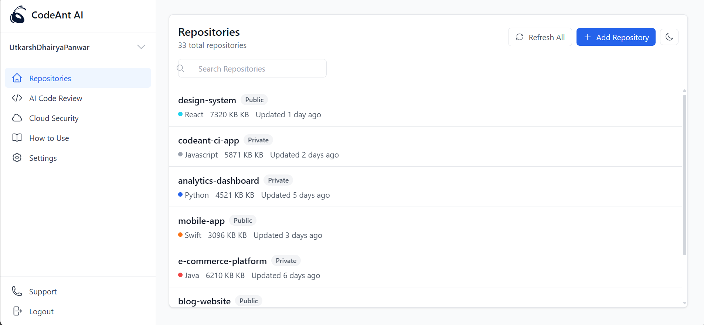
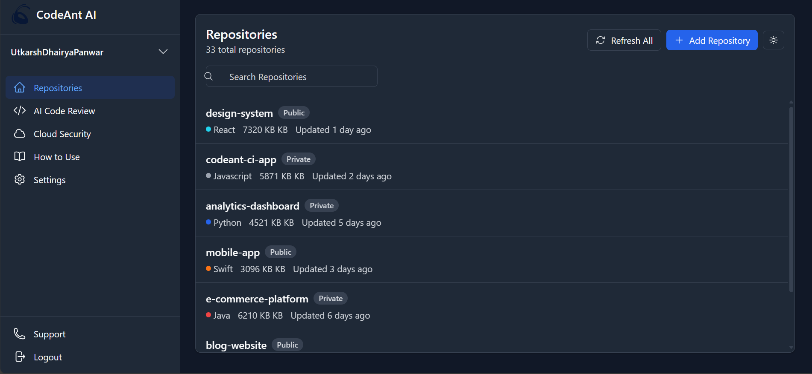

# CodeAnt AI - Repository Management Platform

CodeAnt AI is a modern web application for managing repositories with AI-powered code analysis and auto-fixing capabilities. It provides an intuitive interface for developers to manage their code repositories with advanced features like automated code review and security scanning.

🚀 **Live Demo**: [CodeAnt AI Platform](https://codeant-frontend-jwtbxhzze-kartikeyshivams-projects.vercel.app/login)

## Screenshots

### Dashboard - Light Mode

### Dashboard - Dark Mode

### Authentication Page

## Features

- 🔒 Secure Authentication (SAAS & Self-hosted options)
- 🌓 Dark/Light Theme Support
- 📊 Repository Analytics Dashboard
- 🤖 AI-powered Code Review
- 🔍 Advanced Repository Search
- 🛡️ Cloud Security Integration
- 📱 Responsive Design (Mobile-first)
- 🔄 Real-time Updates

## Technology Stack

- **Frontend Framework**: React 18
- **Language**: TypeScript
- **Styling**: Tailwind CSS
- **Icons**: Heroicons
- **Routing**: React Router v6
- **State Management**: React Context
- **Build Tool**: Vite
- **Package Manager**: npm/yarn

## Prerequisites

Before running the project, make sure you have:

- Node.js (v16 or higher)
- npm or yarn

## Installation

1. Clone the repository: https://github.com/kartikey-shivam/codeant-frontend

## Available Scripts

- `npm run dev` - Start development server
- `npm run build` - Build for production
- `npm run test` - Run tests
- `npm run lint` - Run ESLint
- `npm run format` - Format code with Prettier

## Development

### Code Style

This project uses:

- ESLint for code linting
- Prettier for code formatting
- TypeScript for type checking

### Tailwind CSS Configuration

The project uses Tailwind CSS with custom configuration:

- Custom colors for light/dark themes
- Custom border radius
- Custom shadows
- Responsive breakpoints

### Theme Support

The application supports both light and dark themes:

- Uses CSS variables for theme colors
- Implements system preference detection
- Allows manual theme switching
- Persists theme preference

## Key Components

- `AuthPage`: Handles user authentication with multiple sign-in options
- `RepositoryList`: Displays and manages repository listings
- `Sidebar`: Navigation component with user profile management
- `ThemeProvider`: Manages application-wide theme state

## Contributing

1. Fork the repository
2. Create your feature branch (`git checkout -b feature/AmazingFeature`)
3. Commit your changes (`git commit -m 'Add some AmazingFeature'`)
4. Push to the branch (`git push origin feature/AmazingFeature`)
5. Open a Pull Request

## License

This project is licensed under the MIT License - see the [LICENSE](LICENSE) file for details.

## Support

For support, email support@codeant.ai or join our Slack community.

## Acknowledgments

- [Heroicons](https://heroicons.com/) for the beautiful icons
- [Tailwind CSS](https://tailwindcss.com/) for the utility-first CSS framework
- [React](https://reactjs.org/) for the frontend library

## Quick Links

- 🌐 [Live Demo](https://codeant-frontend-jwtbxhzze-kartikeyshivams-projects.vercel.app/login)
- 📦 [GitHub Repository](https://github.com/kartikey-shivam/codeant-frontend)
- 📄 [Documentation](#)
- 🐛 [Report an Issue](https://github.com/kartikey-shivam/codeant-frontend/issues)
